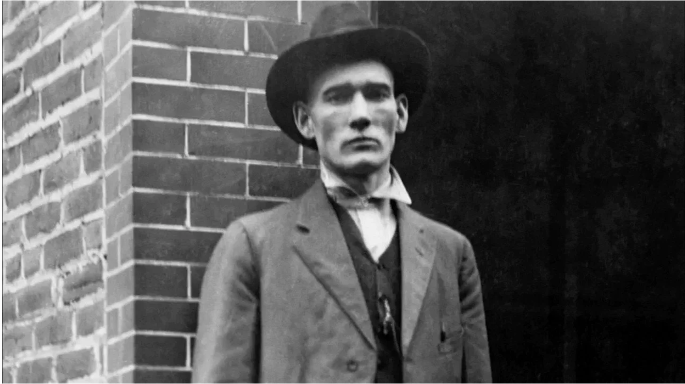

# Police-Project
<h1>Police history & culture</h1>
<h2>Sid Hatfield (Matewan’s chief of police)</h2>
<h3>Birthday: May 15</h3>

Born in Pike County, Kentucky, Sid worked as a blacksmith and a coal miner before enlisting to serve in World War I. Having the reputation of a rough-living man, some citizens were surprised when Mayor Cabel Testerman named him Matewan’s chief of police. But he and Testerman shared an unyielding commitment to the miners’ right to organize. Both men would put their lives on the line for that belief.

<b>"He was a man of action, Sid became the miner’s hero, As they climbed the courthouse steps, they were met by several Baldwin-Felts agents who shot and killed the two men, Sid Hatfield’s name became forever enshrined in West Virginia history as a true miners’ friend when so few were to be found." (murdered for standing up to bad people or businesses in defense of his people and community)</b>

Source: West Virginia Mine Wars Museum, 401 Mate Street, Matewan, WV, 25678, United States

<h2>U.S.A</h2>

<h2>U.K.</h2>

<h2>South Korea</h2>

<h2>Japan</h2>

